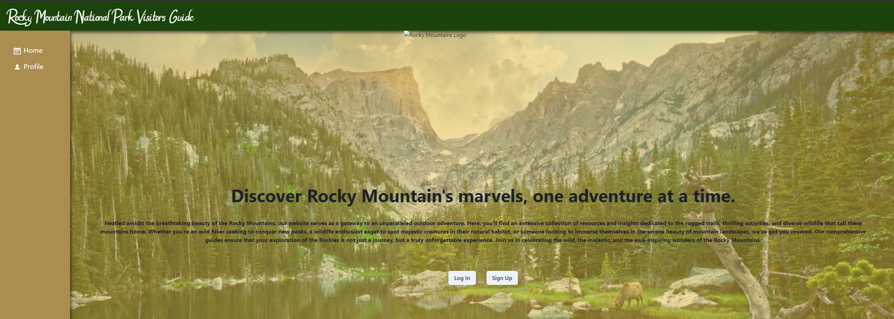
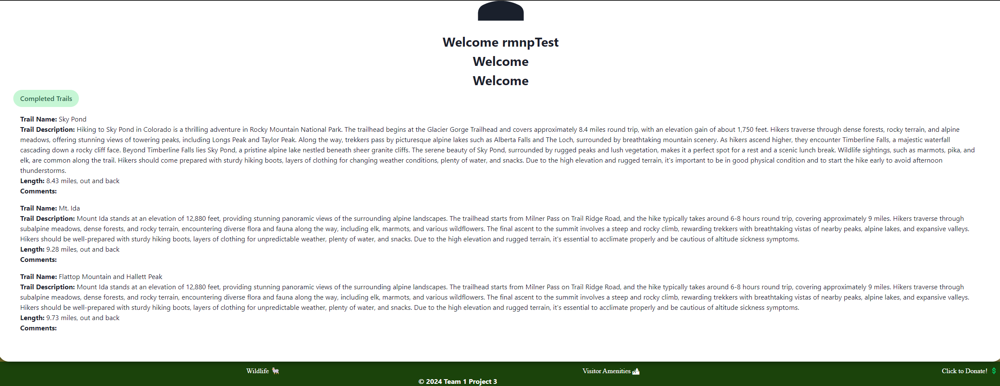

# rocky mountain national park visitors guide

https://rockymountainnationalparkvisitorsguide.onrender.com/

 

## Description
The reason for this project was to make an app that would help users that are interested in hiking our local Rocky Mountain National Park. Along this project I learned a working primarily in the front end and a bit in the backend. However, the most important things I learned are as follows:
* Creating a sidebar. I had never attempted to create a navigation bar besides the traditional top right nav. Also adding the fact of learning a new component library such as Chakra UI. This was very challenging at first, considering I lost almost a day and half following the wrong tutorial. However, after trial and error with that tutorial some base components were similar to which I found another video explaining how to create it. Adding a personalized touch such as hover effects and outside library icons was also a bit of a learning curve with chakra but eventually figured it out. 
* Tabs. In the users profile it was a challenge trying to get the items to center but also getting the tabs where users would have completed trails. Due to time constraints we could not see our full picture of adding 'Favorite trails', 'animal seen', among other features but this was a very fun style component trying to link to backend information and implementing. 
* Getting toast to work. Chakra has a very nice feature that allows a 'toast' to come up. This allows user to see a message displaying a certain text. In this case I only used error and success for loggin in. Getting this to work upon logging in was neat to see but major shout outs to Alex for connecting the backend and front end allowing this toast feature to work as it should! 
* Teamwork and communication is key. In this project communication was very important to make sure we knew where everyone was and where everyone needed help. Making sure to also tell everyone when we were pushing up and making changes to make sure there werent any conflicts. Thankfully this team made it easy to reach out for help. 

## Table of Contents
-[Descriptions](#Descriptions)
-[Installation](#Installation)
-[Usage](#Usage)
-[Credits](#Credits)
-[Tests](#Tests)
-[License](#License)
-[Questions](##Questions)

## Installation
In order to install this project you will have to clone the repository: 
    1. Create a place where you will want to store all this information 
    2. Once there open GitBash
    3. Clone this repository into the file you will have this stored in
            enter following: git@github.com:alexlofton/rockymountainnationalparkvisitorsguide.git
    4. Press enter to create your local clone

## Usage
This can be used to gather information for your next hike to RMNP!

## Credits
Major shout outs to my amazing team!
[Alex](https://github.com/alexlofton)
[Ophelia](https://github.com/MoonstruckOccultist)
[James](https://github.com/jamesbruckner)
[Lilly](https://github.com/lilyvander)

## Tests
N/A
## License
MIT

## Questions
If you have any questions or concerns feel free to reach out via the following:
GitHub:[juanthtgotaway](https://github.com/juanthtgotaway)